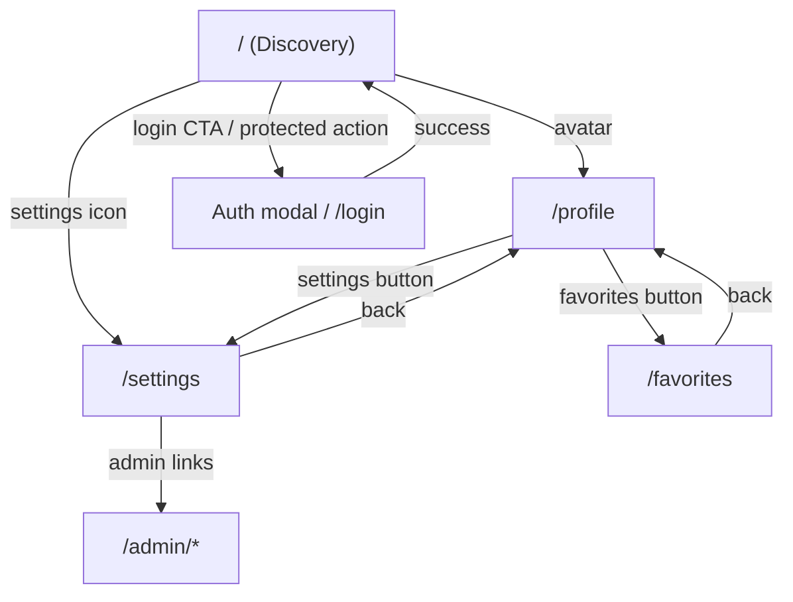

# Этап 0: Route Map И Логические Связи

Документ фиксирует реальные маршруты приложения и связи между экранами.  
Цель: редизайн не должен ломать навигацию и рабочие пользовательские пути.

## 1. Глобальные роуты (frontend)

Источник: `/Users/a1/Desktop/Prog/gde-coffee/frontend/src/App.tsx`.

| Route | Экран | Доступ |
|---|---|---|
| `/` | DiscoveryScreen | публичный |
| `/login` | LoginPage | публичный |
| `/profile` | ProfileScreen | публичный, но часть действий требует auth |
| `/favorites` | FavoritesPage | авторизованный (иначе редирект/логин) |
| `/settings` | SettingsScreen | публичный, часть действий требует auth |
| `/admin/moderation` | AdminModerationPage | moderator/admin |
| `/admin/drinks` | AdminDrinksPage | moderator/admin |
| `/admin/metrics` | AdminNorthStarPage | moderator/admin |
| `/admin/cafes/manage` | AdminCafesManagePage | admin |
| `/admin/cafes/import` | AdminCafesImportPage | admin |
| `/admin/feedback` | AdminFeedbackPage | admin |
| `/verify-email` | VerifyEmailPage | публичный |
| `/confirm-email-change` | ConfirmEmailChangePage | публичный |
| `/reset-password` | ResetPasswordPage | публичный |

`*` -> redirect to `/`.

## 2. Overlay-модель роутов

Если `profile/settings` открываются из `Discovery`, используется `backgroundLocation`:
- базовый экран (`/`) не размонтируется;
- `profile/settings` рендерятся поверх (overlay);
- возврат назад возвращает пользователя в прежнее состояние карты/шторки/фильтров.

Это критичный контракт для UX.

## 3. Карта переходов между экранами

## 4. In-screen навигация и панели Discovery (без смены route)

Внутри `/` работает собственный state-router:
- `SettingsDrawer` (настройки главного экрана),
- `CafeDetailsScreen` (деталка кофейни),
- `CafePhotoAdminModal` (админ-управление фото),
- `CafePhotoSubmissionModal` (пользовательская отправка фото),
- `CafeProposalModal` (предложение кофейни),
- `ManualPickOverlay` (ручной выбор точки на карте),
- состояния `BottomSheet`: `peek/mid/full`.

Это не URL-роуты, но это полноценные UX-состояния и их нужно учитывать в редизайне.

## 5. Ключевые связи для работоспособности

1. `Discovery -> Profile -> Back` не должен сбрасывать состояние карты и фильтров.
2. `Discovery -> SettingsDrawer` должен менять выдачу без потери контекста.
3. `Discovery -> CafeDetails -> Back` должен возвращать в тот же контекст списка/карты.
4. Для protected действий должна открываться auth-модалка поверх текущего контекста.
5. Админ-роуты доступны только при корректной роли.

## 6. Контроль изменений в редизайне

Перед merge любого шага волны проверяем:
1. Базовые переходы из раздела 3 работают.
2. Overlay-поведение из раздела 2 не сломано.
3. In-screen панели Discovery из раздела 4 открываются/закрываются без потери состояния.
